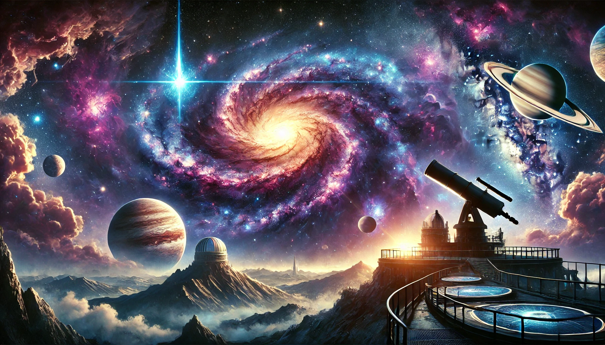

# Astronomy 12

Visit the [course website](https://teaghan.github.io/astronomy-12/) for a more user-friendly interaction with the course content.

Welcome to Astronomy 12, a course that connects key ideas from chemistry, physics, and earth sciences to help you explore the vast field of astronomy. Through hands-on activities, projects, and discussions, you’ll learn about celestial phenomena and the science behind them. As we study the history and modern discoveries in astronomy, you'll gain a better understanding of the universe and see how different areas of science work together to explain the cosmos.

## Course Resources

- **Free Textbook**: [**Astronomy**](https://openstax.org/books/astronomy/pages/1-introduction) by OpenStax.
- **AI Tutor**: [**Astronomy Tutor**](https://chatgpt.com/g/g-10CjMHMvk-astronomy-tutor) to support you with this class.

## Course Overview

[**Unit 1:** Introduction to Astronomy](https://github.com/teaghan/astronomy-12/tree/main/Unit1)
   - [1.1 A Brief History of Astronomy](https://github.com/teaghan/astronomy-12/tree/main/Unit1/1_1_history.ipynb)
   - [1.2 The Scale of the Universe](https://github.com/teaghan/astronomy-12/tree/main/Unit1/1_2_scale.ipynb)
   - [1.3 The Celestial Sphere](https://github.com/teaghan/astronomy-12/tree/main/Unit1/1_3_the_sky.ipynb)
   - [1.4 The Brightness of Stars](https://github.com/teaghan/astronomy-12/tree/main/Unit1/1_4_brightness.ipynb)
   - [1.5 Consequences of Light Travel Time](https://github.com/teaghan/astronomy-12/tree/main/Unit1/1_5_light_travel.ipynb)

[**Unit 2:** Observing the Sky and Celestial Mechanics](https://github.com/teaghan/astronomy-12/tree/main/Unit2)
   - [2.1 Kepler’s Laws of Planetary Motion](https://github.com/teaghan/astronomy-12/tree/main/Unit2/2_1_keplers_laws.ipynb)
   - [2.2 Newton's Law of Universal Gravitation](https://github.com/teaghan/astronomy-12/tree/main/Unit2/2_2_gravity.ipynb)
   - [2.3 Circular Motion](https://github.com/teaghan/astronomy-12/tree/main/Unit2/2_3_circular_motion.ipynb)
   - [2.4 The Structure and Components of Our Solar System I](https://github.com/teaghan/astronomy-12/tree/main/Unit2/2_4_solar_system_1.ipynb)
   - [2.5 The Structure and Components of Our Solar System II](https://github.com/teaghan/astronomy-12/tree/main/Unit2/2_5_solar_system_2.ipynb)

[**Unit 3:** Stars](https://github.com/teaghan/astronomy-12/tree/main/Unit3)
   - [3.1 Star Formation](https://github.com/teaghan/astronomy-12/tree/main/Unit3/3_1_star_formation.ipynb)
   - [3.2 Atoms and Elements](https://github.com/teaghan/astronomy-12/tree/main/Unit3/3_2_atoms_particles.ipynb)
   - [3.3 Nuclear Fusion](https://github.com/teaghan/astronomy-12/tree/main/Unit3/3_3_nuclear_fusion.ipynb)
   - [3.4 Chemical Composition of Stars](https://github.com/teaghan/astronomy-12/tree/main/Unit3/3_4_chemical_composition.ipynb)
   - [3.5 Life Cycle of Stars](https://github.com/teaghan/astronomy-12/tree/main/Unit3/3_5_life_cycle.ipynb)

[**Unit 4:** Light and Spectroscopy](https://github.com/teaghan/astronomy-12/tree/main/Unit4)
   - [4.1 Nature of Light](https://github.com/teaghan/astronomy-12/tree/main/Unit4/4_1_solar_system_formation.ipynb)
   - [4.2 Blackbody Radiation](https://github.com/teaghan/astronomy-12/tree/main/Unit4/4_2_blackbody.ipynb)
   - [4.3 Atomic Energies](https://github.com/teaghan/astronomy-12/tree/main/Unit4/4_3_atomic_energies.ipynb)
   - [4.4 Spectroscopy I: Principles of Spectroscopy](https://github.com/teaghan/astronomy-12/tree/main/Unit4/4_4_spectroscopy_1.ipynb)
   - [4.5 Spectroscopy II: Applications of Spectroscopy](https://github.com/teaghan/astronomy-12/tree/main/Unit4/4_5_spectroscopy_2.ipynb)

[**Unit 5:** Galaxies and the Universe](https://github.com/teaghan/astronomy-12/tree/main/Unit6)
   - [5.1 Types of Galaxies](https://github.com/teaghan/astronomy-12/tree/main/Unit5/5_1_galaxy_types.ipynb)
   - [5.2 Cosmology](https://github.com/teaghan/astronomy-12/tree/main/Unit5/5_2_cosmology.ipynb)
   - [5.3 Future of the Universe](https://github.com/teaghan/astronomy-12/tree/main/Unit5/5_3_universe_future.ipynb)
   - [5.4 The Expanding Universe](https://github.com/teaghan/astronomy-12/tree/main/Unit5/5_4_expanding_universe.ipynb)
   - [5.5 Dark Matter and Dark Energy](https://github.com/teaghan/astronomy-12/tree/main/Unit5/5_5_dark_matter_energy.ipynb)

## Evaluation
- **Summary Notes**: 10%
- **Assignments and Projects**: 40%
- **Midterm Exam**: 25%
- **Final Exam**: 25%
