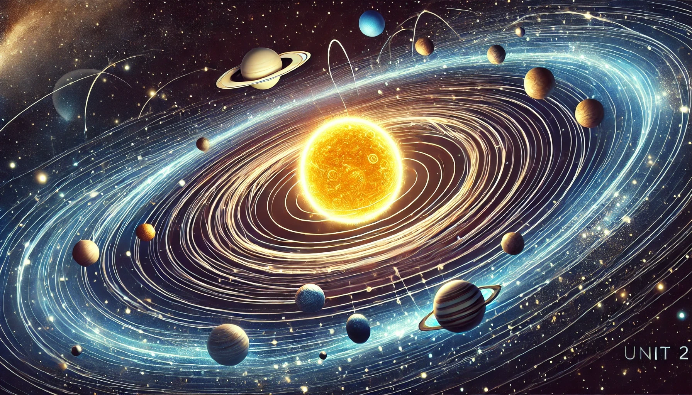

## Unit 2: Gravity and Our Solar System

This unit delves into the laws governing the motion of celestial bodies, including planets, moons, and satellites. It covers gravitational forces and orbital mechanics, providing a comprehensive understanding of the principles that dictate the movement and interaction of objects in space.

### Teacher Assessment
- Summary Notes
- Assignment/Project

### Self-Assessment
- Each section of this unit includes a set of "Check Your Understanding" questions that are designed to prepare you for the midterm exam.

### [Summary Notes](https://teaghan.github.io/astronomy-12/Unit2/Unit2_Summary_Notes.pdf)

- While going through the lessons, working on the Check Your Understanding problems, and completing any assignment/project, you are expected to take meaningful notes for your future self. These notes can include concepts, diagrams, examples, etc.
- **You will be allowed to access to these notes during the test!**
- Print out the summary notes file and fill it with useful, hand-written notes while working through this unit and submit your notes at the end of the unit to be assessed for completion.
- There is a suggested set of topics as well as empty boxes to give you the opportunity to summarize additional topics.

### [2.1 Kepler’s Laws of Planetary Motion](https://github.com/teaghan/astronomy-12/tree/main/Unit2/2_1_keplers_laws.ipynb)
   - Law of Orbits: All planets move in elliptical orbits, with the Sun at one focus.
   - Law of Areas: A line that connects a planet to the Sun sweeps out equal areas during equal intervals of time.
   - Law of Periods: The square of the period of any planet is proportional to the cube of the semi-major axis of its orbit.

### [2.2 Newton's Law of Universal Gravitation](https://github.com/teaghan/astronomy-12/tree/main/Unit2/2_2_gravity.ipynb)
   - Definition and formula
   - Gravitational constant
   - Inverse square law
   - Applications of gravitational theory

### [2.3 Circular Motion](https://github.com/teaghan/astronomy-12/tree/main/Unit2/2_3_circular_motion.ipynb)
   - Definition and formula for centripetal force
   - Examples of centripetal forces in daily life and astronomy
   - Orbital speed and its derivation

### [2.4 The Structure and Components of Our Solar System I](https://github.com/teaghan/astronomy-12/tree/main/Unit2/2_4_solar_system_1.ipynb)
   - Formation of the Solar System
   - The Sun: structure and composition
   - Terrestrial planets: characteristics and notable features
   - Jovian planets: characteristics and notable features

### [2.5 The Structure and Components of Our Solar System II](https://github.com/teaghan/astronomy-12/tree/main/Unit2/2_5_solar_system_2.ipynb)
   - Dwarf planets: Pluto, Eris, Ceres, Haumea, Makemake
   - Asteroids and the asteroid belt: origin and significant examples
   - Comets and the Kuiper Belt: structure and notable comets
   - Meteoroids, meteors, and meteorites: definitions and historical impacts
   - Moons of the Solar System: notable examples and formation theories
   - The Oort Cloud: hypothetical cloud of icy bodies and its role in the solar system

### [Assignment: Investigating Galaxy Data](https://teaghan.github.io/astronomy-12/Unit2/Unit2_Assignment.pdf)
- Print off the attached assignment.
- Follow the steps and complete the questions.
- Submit your document with the questions answered.

### Course Resources
- **Free Textbook**: [**Astronomy**](https://openstax.org/books/astronomy/pages/1-introduction) by OpenStax.
- **AI Tutor**: [**Astronomy Tutor**](https://chatgpt.com/g/g-10CjMHMvk-astronomy-tutor) to support you with this class.

### Science Curricular Connections
- **Physics 12:** uniform circular motion, centripetal force and acceleration, changes to apparent weight, gravitational field and Newton’s law of universal gravitation, gravitational dynamics
- **Physics 11:** mass, force of gravity, apparent weight, Newton’s laws of motion, horizontal uniform and accelerated motion
- **Earth Sciences 11:** astronomy seeks to explain the origin and interactions of Earth and its solar system, impacts of the Earth-moon-sun system

### Learning Standards
- I can state Kepler's First Law and explain the concept of elliptical orbits with the Sun at one focus.
- I can describe the characteristics of an ellipse and its relevance to planetary orbits.
- I can explain Kepler's Second Law and the concept of equal areas in equal time periods.
- I can describe the relationship between a planet's distance from the Sun and its orbital speed according to Kepler's Second Law.
- I can use Kepler's Third Law to calculate the orbital period of a planet given its semi-major axis.
- I can verify the consistency of Kepler's Third Law for different planets.
- I can use Newton's Second Law to calculate the force acting on an object given its mass and acceleration.
- I can explain the relationship between mass, force, and acceleration according to Newton's Second Law.
- I can calculate the gravitational force between two masses using Newton's Law of Universal Gravitation.
- I can explain the concept of the inverse square law in the context of gravitational force.
- I can describe the importance of the gravitational constant G in Newton's law.
- I can explain the concept of weight as the gravitational force acting on an object.
- I can describe the role of gravity in maintaining the orbits of planets and satellites.
- I can describe the formation of the solar system from the solar nebula.
- I can explain the role of gravity and circular motion in the formation of the Sun and planets.
- I can calculate the centripetal force acting on an object moving in a circular path.
- I can describe the relationship between gravitational force and centripetal force in orbital motion.
- I can calculate the centripetal acceleration of an object moving in a circular orbit.
- I can derive the formula for orbital speed and explain its significance in astronomy.
- I can calculate the orbital speed of moons and satellites using the given distance and mass of the central body.
- I can calculate the orbital period of a moon or satellite using Kepler's Third Law.
- I can calculate the surface gravity on a moon or planet given its mass and radius.