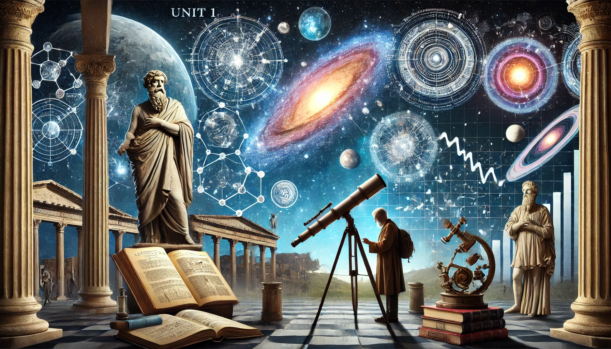

## Unit 1: Introduction to Astronomy and the Scientific Method

This unit sets the stage for understanding the vastness and complexity of the cosmos by introducing students to the historical development of astronomy, the immense scale of the universe, the night sky, and the effects of light travel time.

### Teacher Assessment

- Summary Notes
- Assignment/Project

### Self-Assessment

Each section of this unit includes a set of "Check Your Understanding" questions that are designed to prepare you for the midterm exam.

### [Summary Notes](https://teaghan.github.io/astronomy-12/Unit1/Unit1_Summary_Notes.pdf)

While going through the lessons, working on the Check Your Understanding problems, and completing any assignment/project, you are expected to take meaningful notes for your future self. These notes can include concepts, diagrams, examples, etc.

**You will be allowed to access to these notes during the test!**

Print out the summary notes file and fill it with useful, hand-written notes while working through this unit and submit your notes at the end of the unit to be assessed for completion.

There is a suggested set of topics as well as empty boxes to give you the opportunity to summarize additional topics.

### [1.1 A Brief History of Astronomy](../md_files/1_1_history.html)
- Explore the evolution of astronomical understanding from ancient civilizations to modern times.
- Significant contributions from astronomers such as Ptolemy, Copernicus, Galileo, and Newton.

### [1.2 The Scale of the Universe](../md_files/1_2_scale.html)
- Understand the vast distances in space using scientific notation.
- Learn about the structure and size of the solar system, the Milky Way, and the observable universe.

### [1.3 The Celestial Sphere](../md_files/1_3_the_sky.html)
- Concept of the celestial sphere and its components: celestial poles, celestial equator, and ecliptic.
- Understand the apparent motion of stars and constellations.

### [1.4 The Brightness of Stars](../md_files/1_4_brightness.html)
- Differentiate between luminosity, flux, and apparent brightness.
- Understand the inverse square law of light.
- Explore the magnitude scale and the distance modulus.

### [1.5 Consequences of Light Travel Time](../md_files/1_5_light_travel.html)
- Effect of the finite speed of light on observations.
- Concept of looking back in time.

### [Unit 1 Assignment: Night Sky Observations](https://teaghan.github.io/astronomy-12/Unit1/Unit1_Assignment.pdf)

- Print off the attached assignment.
- Follow the steps and complete the questions.
- Submit your document with the questions answered.

**Science Curricular Connections:**
- **Earth Science 11:** The nebular hypothesis, Stars as the center of a solar system

**Learning Standards:**
- I can use scientific notation to express large astronomical distances.
- I can describe the scale of the universe and its components.
- I can explain the concept of a light-year and its importance in measuring cosmic distances.
- I can describe how parallax is used to measure the distance to nearby stars.
- I can explain the concept of the celestial sphere and its components.
- I can explain the apparent daily and annual motion of the Sun, Moon, and stars.
- I can define flux and luminosity and explain their relationship.
- I can apply the inverse square law to calculate the apparent brightness of stars.
- I can distinguish between apparent magnitude and absolute magnitude.
- I can use the distance modulus formula to determine the distance to stars.
- I can explain how observing distant objects allows us to look back in time.
- I can describe the methods used to measure cosmic distances, including parallax and standard candles.