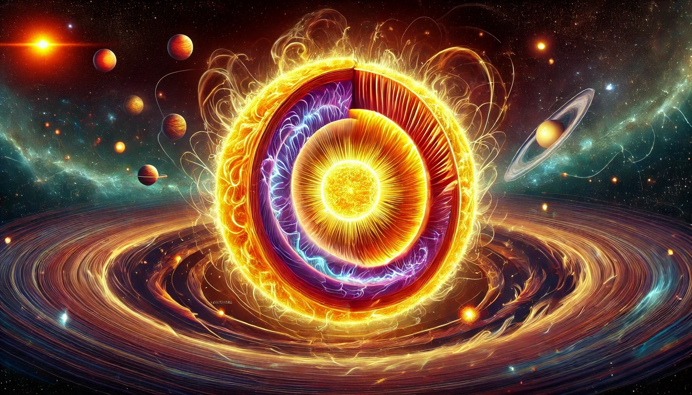

## Unit 3: Stars

This unit explores the fascinating life cycles of stars, from their formation in molecular clouds to their ultimate demise as white dwarfs, neutron stars, or black holes. It covers the processes that power stars, their chemical compositions, and the physical principles that govern their radiation.

### Teacher Assessment
- Summary Notes
- Assignment/Project

### Self-Assessment
- Each section of this unit includes a set of "Check Your Understanding" questions that are designed to prepare you for the midterm exam.

### [Summary Notes](https://teaghan.github.io/astronomy-12/Unit3/Unit3_Summary_Notes.pdf)

- While going through the lessons, working on the Check Your Understanding problems, and completing any assignment/project, you are expected to take meaningful notes for your future self. These notes can include concepts, diagrams, examples, etc.
- **You will be allowed to access these notes during the test!**
- Print out the summary notes file and fill it with useful, hand-written notes while working through this unit and submit your notes at the end of the unit to be assessed for completion.
- There is a suggested set of topics as well as empty boxes to give you the opportunity to summarize additional topics.

### [3.1 Star Formation](../md_files/3_1_star_formation.html)
   - Molecular Clouds and Protostars: The initial stages of star formation from molecular clouds to protostars.
   - Angular momentum
   - Observational Evidence: Infrared images and other observational data supporting star formation.

### [3.2 Atoms and Elements](../md_files/3_2_atoms_particles.html)
   - Basic atomic structure
   - Protons, neutrons, electrons
   - Neutrinos, photons
   - Isotopes
   - Chemical Reactions

### [3.3 Nuclear Fusion](../md_files/3_3_nuclear_fusion.html)
   - Fusion Processes: The proton-proton chain and the CNO cycle.
   - Energy Generation: How nuclear fusion powers stars, focusing on temperature and pressure conditions in the stellar core.
   - Creating Heavier Elements

### [3.4 Chemical Composition of Stars](../md_files/3_4_chemical_composition.html)
   - Stellar Spectroscopy: Techniques to determine the chemical composition of stars.
   - Abundance of Elements: How the relative abundance of elements provides clues about star formation and evolution.
   - Nucleosynthesis: The process of nucleosynthesis in stars, creating elements during different fusion stages and supernovae.

### [3.5 Life Cycle of Stars](../md_files/3_5_life_cycle.html)
   - Main Sequence Evolution: The life of a star on the main sequence and the changes as it exhausts its hydrogen fuel.
   - Post-Main Sequence Evolution: Evolutionary paths after the main sequence, including red giants, supernovae, white dwarfs, neutron stars, and black holes.
   - Stellar Remnants: Types and observational properties of stellar remnants.
   - The Hertzsprung-Russell (H-R) Diagram: Understanding the H-R diagram and its significance in studying stellar evolution.

### [Assignment: Stellar Evolution](https://teaghan.github.io/astronomy-12/Unit3/Unit3_Assignment.pdf)
- Print off the attached assignment.
- Follow the steps and complete the questions.
- Submit your document with the questions answered.

### Course Resources
- **Free Textbook**: [**Astronomy**](https://openstax.org/books/astronomy/pages/1-introduction) by OpenStax.
- **AI Tutor**: [**Astronomy Tutor**](https://chatgpt.com/g/g-10CjMHMvk-astronomy-tutor) to support you with this class.

### Science Curricular Connections

**Physics 11:**
- mass, force of gravity
- balanced and unbalanced forces in systems
- conservation of energy; principle of work and energy
- generation and propagation of waves
- properties and behaviors of waves

**Physics 12:**
- gravitational field and Newton’s law of universal gravitation
- gravitational dynamics and energy relationships
- Electric field 
- electrostatic dynamics and energy relationships
- electromagnetic induction
- electrostatic dynamics and energy relationships 
- applications of electromagnetic induction
- imomentum
- conservation of momentum

**Chemistry 11:**
- quantum mechanical model and electron configuration
- valence electrons
- bonds/forces
- reactions

**Chemistry 12:**
- energy change during a chemical reaction

**Earth Sciences 11:**
- solar radiation interactions
- the nebular hypothesis (explanation of the formation and properties of our solar system)

### Learning Standards
- I can describe the process of star formation, from molecular clouds to protostars.
- I can explain the role of angular momentum in the formation of stars.
- I can calculate the angular momentum and moment of inertia when given the shape and mass of an object.
- I can use the conservation of angular momentum to determine how the rotational speed of an object changes when the radius changes.
- I can explain the basic structure of atoms, including protons, neutrons, and electrons.
- I can identify the role of isotopes in stellar chemistry.
- I can describe the importance of neutrinos and photons in stellar processes.
- I can explain the conditions necessary for nuclear fusion to ignite within protostars.
- I can describe the proton-proton chain reaction and the CNO cycle in stars.
- I can explain the process of nucleosynthesis and apply it to the creation of heavier elements in stars.
- I can calculate the energy output of a nuclear fusion reaction.
- I can use the Hertzsprung-Russell (H-R) diagram to classify stars and predict their future evolution.
- I can describe how the mass of a star influences its evolutionary path and final state, such as becoming a white dwarf, neutron star, or black hole.
- I can explain the life cycle of stars from the main sequence to their end stages, comparing the different paths taken by low-mass and high-mass stars.