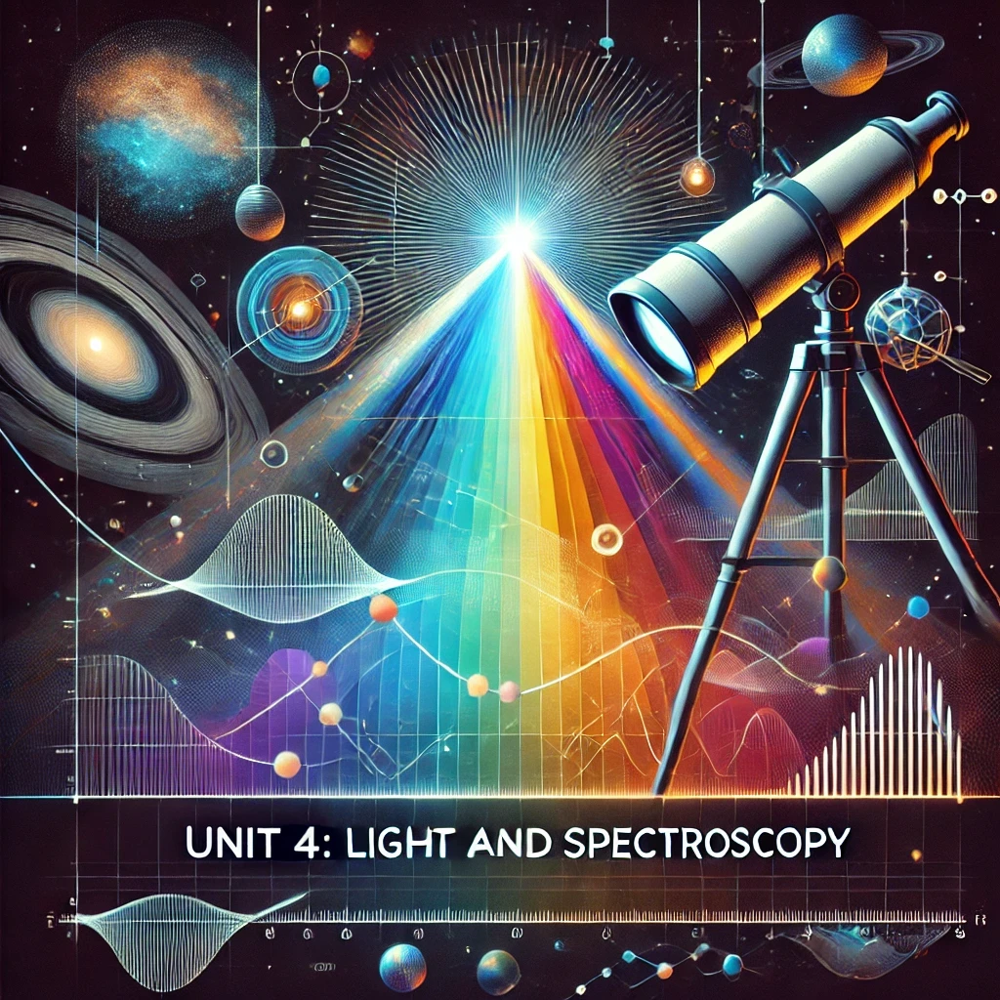

## Unit 4: Light and Spectroscopy

Spectroscopy is a crucial tool in astronomy, enabling us to decode the light from stars, galaxies, and distant worlds to uncover their secrets. In this unit, you'll explore the nature of light, from the electromagnetic spectrum to wave-particle duality. Discover how blackbody radiation reveals the temperatures of celestial objects, how atomic energies produce the spectral lines that serve as cosmic fingerprints, and how spectroscopy helps astronomers determine the composition, temperature, and motion of objects across the universe.

### Teacher Assessment
- Summary Notes
- Assignment/Project

### Self-Assessment
- Each section of this unit includes a set of "Check Your Understanding" questions that are designed to prepare you for the midterm exam.

### [4.1 Nature of Light](https://github.com/teaghan/astronomy-12/tree/main/Unit4/4_1_nature_of_light)
- **Electromagnetic Spectrum**: Overview of the different types of electromagnetic radiation and their significance in astronomy.
- **Wave-Particle Duality**: Discussion of light's dual nature, emphasizing wave and particle properties.
- **Polarization of Light**: Introduction to light polarization and its applications in astronomy.

### [4.2 Blackbody Radiation](../md_files/4_2_blackbody.html)
- **Planck’s Law and Spectrum**: Description of the spectrum of radiation emitted by a blackbody.
- **Wien’s Displacement Law**: Relating temperature to the peak wavelength of blackbody radiation.
- **Stefan-Boltzmann Law**: Explaining the total energy radiated per unit surface area in relation to temperature.
- **Color Indices and Stellar Classification**: Overview of how color indices help classify stars based on temperature and color.

### [4.3 Atomic Energies](../md_files/4_3_atomic_energies.html)
- **Model of the Atom**: Introduction to the structure of the atom, including the nucleus and electron orbits.
- **Interaction of Electromagnetic Radiation with Atoms**: Explanation of how light interacts with atoms, leading to the absorption and emission of photons.
- **Formation of Spectral Lines**: Understanding how spectral lines are formed through electronic transitions in atoms.
- **Molecular Spectroscopy**: Brief introduction to molecular spectra and their role in studying interstellar gas clouds.

### [4.4 Spectroscopy I: Principles of Spectroscopy](../md_files/4_4_spectroscopy_1.html)
- **Absorption and Emission Spectra**: Exploring how and why absorption and emission spectra are produced in different astrophysical environments.
- **Kirchhoff's Laws of Spectroscopy**: Explanation of Kirchhoff's laws and their applications to continuous spectra, emission lines, and absorption lines.
- **Spectral Line Broadening**: Discussing different mechanisms of line broadening (e.g., Doppler broadening) and their significance in astronomy.

### [4.5 Spectroscopy II: Applications of Spectroscopy](../md_files/4_5_spectroscopy_2.html)
- **Identifying Elements in Stars**: How spectroscopy is used to identify the chemical composition of stars.
- **Measuring Stellar Velocities**: Discussion of the Doppler effect and how radial velocity measurements are used to study stellar motion and detect exoplanets.
- **The Science of Spectroscopy**: Overview of line lists, catalogs of spectral lines, and how they are used in practical spectroscopic analysis.

### [Assignment: Spectroscopy in Action](https://teaghan.github.io/astronomy-12/Unit4/Unit4_Assignment.pdf)
- Print off the attached assignment.
- Follow the steps and complete the questions.
- Submit your document with the questions answered.

### Course Resources
- **Free Textbook**: [**Astronomy**](https://openstax.org/books/astronomy/pages/1-introduction) by OpenStax.
- **AI Tutor**: [**Astronomy Tutor**](https://chatgpt.com/g/g-10CjMHMvk-astronomy-tutor) to support you with this class.

### Science Curricular Connections

**Physics 11:**
- Properties and behaviors of waves
- Generation and propagation of waves

**Physics 12:**
- Electromagnetic induction and its applications
- Doppler effect

**Chemistry 11:**
- Quantum mechanical model and electron configuration
- Analysis techniques (e.g., spectroscopy)

**Chemistry 12:**
- Energy change during a chemical reaction

**Earth Sciences 11:**
- Solar radiation interactions

### Learning Standards
- I can describe the electromagnetic spectrum and wave-particle duality.
- I can explain the principles of blackbody radiation, including Planck's Law, Wien's Displacement Law, and the Stefan-Boltzmann Law.
- I can explain the structure of the atom and how electromagnetic radiation interacts with atoms to produce spectral lines.
- I can distinguish between absorption and emission spectra and explain how these spectra are produced.
- I can apply Kirchhoff's laws of spectroscopy to explain continuous, emission, and absorption spectra.
- I can explain the mechanisms of spectral line broadening and their significance in astrophysical observations.
- I can use spectroscopy to identify the chemical composition of stars.
- I can explain how the Doppler effect is used to measure stellar velocities.
- I can describe how line lists and catalogs of spectral lines are used in practical spectroscopic analysis.