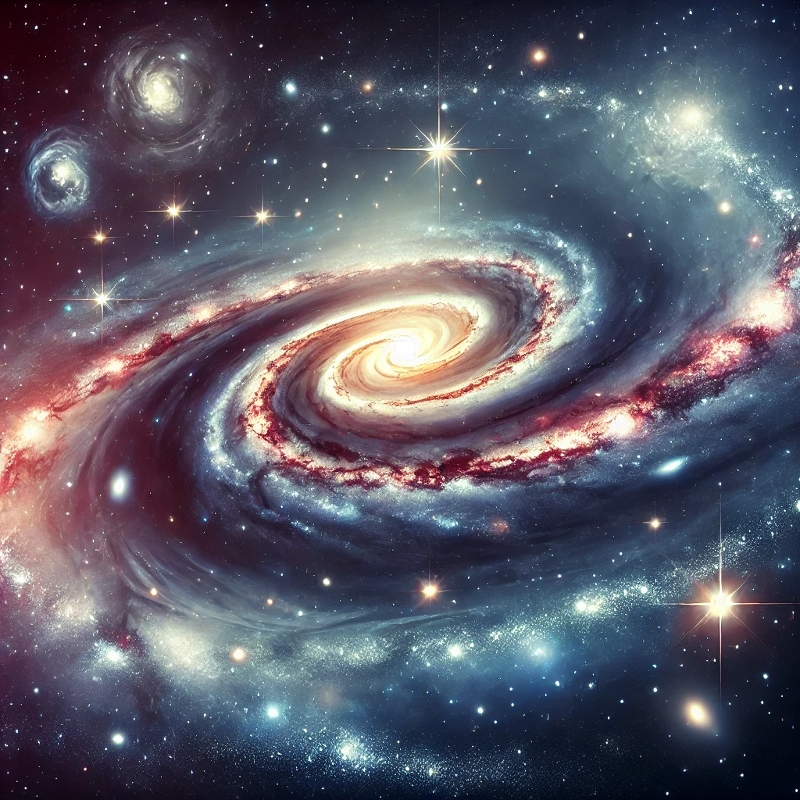

## Unit 5: Galaxies and the Universe

This unit takes students on an expansive journey through the cosmos, exploring the large-scale structure of the universe, the diverse types of galaxies, the mysteries of black holes, and the nature of dark matter and dark energy. Students will uncover how galaxies form and evolve, understand the dynamic processes within black holes, and learn about the possible futures of the universe driven by dark matter and dark energy.

### Teacher Assessment
- Summary Notes
- Assignment/Project

### Self-Assessment
- Each section of this unit includes a set of "Check Your Understanding" questions that are designed to prepare you for the midterm exam.

### [5.1 The Big Bang and the Early Universe](../md_files/5_1_early_universe.html)
- **The Big Bang Theory**: Learn about the evidence supporting the Big Bang, including cosmic microwave background radiation and nucleosynthesis.
- **The Early Universe**: Understand the first few moments after the Big Bang and the formation of the first atomic nuclei.

### [5.2 Cosmology](../md_files/5_2_cosmology.html)
- **Structure of the Universe**: Explore the organization of matter into galaxies, clusters, and superclusters.
- **Hubble’s Law**: Understand how redshift reveals the expansion of the universe and the relationship between distance and velocity for galaxies.
- **The Cosmological Principle**: Learn about the homogeneous and isotropic nature of the universe on large scales.
- **Hubble’s Constant**: Examine the significance of Hubble’s constant and current efforts to refine its value.

### [5.3 Types of Galaxies](../md_files/5_3_types_of_galaxies.html)
- **Spiral, Elliptical, and Irregular Galaxies**: Investigate the different types of galaxies, their structures, and their characteristics.
- **Theories of Formation and Evolution of Galaxies**: Learn about how galaxies form, evolve, and interact over time.
- **Quasars**: Study the energetic centers of galaxies and their importance in understanding the early universe.

### [5.4 Black Holes](../md_files/5_4_black_holes.html)
- **Escape Velocity**: Introduction to the concept of escape velocity and its connection to black holes.
- **Event Horizon**: Explore the boundary around a black hole from which no light or matter can escape.
- **Introduction to General Relativity**: Learn how Einstein’s theory of general relativity explains the warping of spacetime around massive objects.
- **Evidence for Black Holes**: Examine the observational evidence for black holes, including star movements and X-rays from accretion disks.
- **Gravitational Waves**: Discover how gravitational waves provide new insights into black holes and cosmic collisions.

### [5.5 Dark Matter, Dark Energy, and the Fate of the Universe](../md_files/5_5_dark_matter_and_energy.html)
- **Dark Matter**: Understand the role of dark matter in galaxy formation and its observational evidence.
- **Dark Energy**: Learn about dark energy and how it drives the accelerated expansion of the universe.
- **Possible Futures of the Universe**: Explore how dark matter and dark energy influence the ultimate fate of the universe—whether it will expand forever, slow down, or collapse.

### [Assignment: The Universe in Motion](https://teaghan.github.io/astronomy-12/Unit5/Unit5_Assignment.pdf)
- Print off the attached assignment.
- Follow the steps and complete the questions.
- Submit your document with the questions answered.

### Course Resources
- **Free Textbook**: [**Astronomy**](https://openstax.org/books/astronomy/pages/1-introduction) by OpenStax.
- **AI Tutor**: [**Astronomy Tutor**](https://chatgpt.com/g/g-10CjMHMvk-astronomy-tutor) to support you with this class.

### Science Curricular Connections

**Physics 11:**
- Mass, force of gravity, and Newton’s laws of motion
- Energy conservation and the principle of work and energy

**Physics 12:**
- Gravitational field and Newton’s law of universal gravitation
- Relativistic effects and the conservation of momentum

**Earth Sciences 11:**
- The nebular hypothesis and the formation of galaxies

**Chemistry 12:**
- Energy change during reactions and nuclear processes

### Learning Standards
- I can describe the evidence supporting the Big Bang and the key events in the early universe.
- I can explain Hubble’s Law and how it provides evidence for the expanding universe.
- I can describe the different types of galaxies and explain the theories of galaxy formation and evolution.
- I can identify quasars and their significance in the study of galaxies.
- I can explain the basic properties of black holes, including escape velocity and event horizons.
- I can describe the role of general relativity in understanding black holes.
- I can summarize the evidence for black holes and describe how gravitational waves help detect cosmic events.
- I can explain the concept of dark matter and its role in the structure of the universe.
- I can describe the effect of dark energy on the expansion of the universe.
- I can analyze the possible futures of the universe based on the balance of dark matter and dark energy.